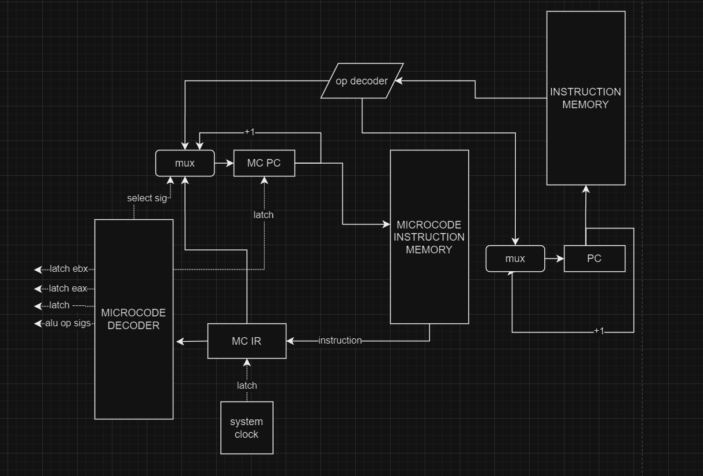

# Эмулятор работы языка программирования на ЭВМ

Ромайкин Эрик, P32121
Без усложнения

## Цель:

- Экспериментальное знакомство с устройством процессоров через моделирование;
получение опыта работы с компьютерной системой на нескольких уровнях организации, разрешая противоречия между ними.

### Данная лабораторная работа носит практический характер. Она включает разработку:

- языка программирования и транслятора;
- системы команд;
- модели процессора и его принципиальной схемы;
- нескольких алгоритмов (реализация и тестирование работы).

### Дополнительно:

- работа с CI;
- средства автоматического контроля качества кода;
- автоматическое тестирование.

## Вариант

```asm | cisc | harv | mc | tick | struct | trap | port | pstr | prob2```

```asm``` - синтаксис ассемблера. Необходима поддержка label-ов.

```cisc``` - система команд должна содержать сложные инструкции:
- переменная длина инструкций (некоторые инструкции не помещаются в машинное слово, даже в struct вариантах необходимо делать выборку за несколько шагов в явном виде);
- арифметические операции, работающие с регистрами и памятью за одну операцию;
- работа со специальными регистрами;

```harv``` - Гарвардская архитектура.

```mc``` - microcoded.
- В отчёте необходимо задокументировать уровень микроинструкций.
- Моделирование должно выполняться с точностью до такта.
- Микрокод должен быть сохранён в отдельной памяти для микропрограмм.
- Модель процессора должна исполнять микрокод.

```tick``` - процессор необходимо моделировать с точностью до такта, процесс моделирования может быть приостановлен на любом такте.

```struct``` - в виде высокоуровневой структуры данных. Считается, что одна инструкция укладывается в одно машинное слово, за исключением CISC архитектур.

```trap```

Ввод-вывод осуществляется токенами через систему прерываний. Логика работы:

- при старте модели у вас есть расписание ввода ([(1, 'h'), (10, 'e'), (20, 'l'), (25, 'l'), (100, 'o')], где цифра -- момент поступления данных, символ -- токен);
- процессор имеет систему прерываний:

    - прерывания считаем внутренними;
    - обработка прерывания должна приводить к вызову реализованного пользователем программного кода;
    - обработчик прерывания реализуется программистом на вашем языке;


- в процессе моделирования идёт отсчёт времени в тактах, по наступлении события ввода -- происходит обработка прерывания;
- из журнала работы процессора должно быть ясно, работаете вы в прерывании или нет;
- вывод данных реализуется посимвольно, как в варианте stream, по выполнении команд в буфер вывода добавляется ещё один символ;
- по окончании моделирования показать все выведенные данные;
- ситуация наступления прерывания во время обработки прерывания должна быть проработана (способ -- на ваше усмотрение);
- логика работы с буферами реализуется в рамках модели на Python;
- не стоит путать "вызов прерывания" и "получение данных".

```port``` - port-mapped (специальные инструкции для ввода-вывода)
- адресация портов ввода-вывода должна присутствовать.

```pstr``` - Length-prefixed (Pascal string)
- Статические строки должны храниться в памяти данных.
- Один символ может храниться в одном машинном слове (несмотря на явную неэффективность).

```prob2``` - Even Fibonacci numbers

Project Euler. Problem 2

Each new term in the Fibonacci sequence is generated by adding the previous two terms. By starting with 1 and 2, the first 10 terms will be:

1, 2, 3, 5, 8, 13, 21, 34, 55, 89, ...

By considering the terms in the Fibonacci sequence whose values do not exceed four million, find the sum of the even-valued terms.

## Язык программирования
```
program ::= terms

terms ::= term
        | terms term

term ::= instruction
       | label_def
       | directive


instruction ::= math_op
              | branch_op
              | alter_op
              | io_op
              | control_op
              | stack_op

math_op ::= math_opcode math_args
math_opcode ::= 'mov'
              | 'add'
              | 'sub'
              | 'cmp'
              | 'mod'

math_args ::= reg_id ',' reg_id
            | mem_by_reg_id ',' reg_id
            | reg_id ',' mem_by_reg_id
            | reg_id ',' label_ref
            | label_ref ',' reg_id
            | reg_id ',' immed


branch_op ::= branch_opcode branch_args
branch_opcode ::= 'jz'
                | 'jnz'
                | 'jn'
                | 'jmp'
branch_args ::= label_ref


alter_op ::= alter_opcode alter_args
alter_opcode ::= 'inc'
               | 'dec'
alter_args ::= reg_id


io_op ::= io_opcode io_args
io_opcode ::= 'in'
            | 'out'


mem_by_reg_id ::= '[' reg_id ']'
reg_id ::= 'eax'
         | 'ebx'
         | 'ecx'
         | 'edx'
         | 'esp'
         | 'eip'

immed ::= i32
        | symbol
port_id ::= i32

directive ::= "word" literal
literal ::= immed
          | string

label_ref ::= label_id
label_def ::= label_id ':'
label_id ::= /^[a-zA-Z0-9_]+$/i


i32 ::= <целое число>
symbol ::= <символ, заключённый в одинарные кавычки>
string ::= <строка, заключённая в двойные кавычки>
```

## Стратегия вычислений

- Имя переменной(лейбла) возвращает ее последнее присвоенное значение
- Имя переменной(лейбла) возвращает ссылку на начало ячейки памяти, в которой
он содержится
- Целочисленному литералу до 20 присваивается буфферизированный участок памяти
- Целочисленному литералу присваивается 1 ячейка памяти
- Видимость лейблов - глобальная. Можно обращаться до их инициализации
- Динамическая типизация, строковые, символьные и целочисленные литералы
- Подробнее см. нотацию БН

## Организация памяти

- Гарвардская архитектура
- Размер машинного слова - 1 символ(4 bytes), либо целочисленное значение
- Память разделена на память данных и память инструкций(Гарвардская архитектура)
```
Instruction memory
    +-----------------+         
    |     DECODED     |         
    +  INSTRUCTIONS   +         
    |                 |         
    |                 |         
    |                 |         
    |                 |         
    +                 +         
    |                 |
    |                 | 
    |                 |
    |                 |
    +                 +
    |                 |
    |                 |
    |                 |
    +-----------------+

Data memory
    +-----------------+         
    |   STATIC DATA   |         
    +                 +         
    |                 |         
    |                 |         
    |                 |         
    |                 |         
    +-----------------+         
    |      STACK      |
    |                 | 
    |                 |
    |                 |
    +                 +
    |                 |
    |                 |
    |                 |
    +-----------------+
```
- Все литералы помещаются в статическую память
- Работа со стеком происходит через специальный регистр

## Система комманд

'add': 4 ticks, - принимает 2 аргумента, складывает их, результат в первый аргумент

'mov': 2 ticks, - принимает 2 аргумента, второй складывает в буффер, буффер пишет в первый аргумент

'sub': 4 ticks, - принимает 2 аргумента, вычитает первый из второго, результат в первый аргумент

'cmp': 4 ticks, - принимает 2 аргумента, sub, результат в eax

'inc': 1 tick, - принимает 1 аргумент, инкрементирует

'dec': 1 tick, - принимает 1 аргумент, декрементирует

'jnz': 1 tick, - принимает 1 аргумент, сравнивает eax с не 0, изменяет eip

'jz': 1 tick, - принимает 1 аргумент, сравнивает eax с 0, изменяет eip

'in': 2-n ticks, - генерирует прерывание, ждет событие ввода, записывает ввод в eax

'out': 1 tick, - записывает вывод в output device

'call': 2 ticks, - принимает 1 аргумент, кладет в стек eip, увеличивает указатель стека

'ret': 2 ticks, - уменьшает указатель стека, eip -> [esp]

'exit': 1 tick, - hlt flag = 1

'mod': 4 ticks, - принимает 2 аргумента, ост. от деления 1 на 2, результат в eax

'jn': 1 tick, - принимает 1 аргумент, сравнивает eax с < 0, изменяет arg -> eip

'jmp': 1 tick - принимает 1 аргумент, изменяет arg -> eip

## Набор инструкций

- совпадает с системой команд
- переменная длина выполнения
- транслируются в микропрограммы

## Транслятор

- Разбор на лексеммы
- Преобразование в AST дерево
- Отдать AST управляющему блоку

На вход подается 3 файла
- Файл с программой
- Девайс для ввода
- Девайс для вывода
- Данные об отладке сохраняются в файл devices/debug

## Модель процессора

### Схема DataPath

### Схема Control Unit


### Листинг микрокомманд

at = arg is reg ? arg : mem[arg]

ALU1 = arg -> ALU1, latch

ALU2 = arg -> ALU2, latch

ALU_SIG_SUM = sig_sum -> ALU

ALU_SIG_SUB = sig_sub -> ALU

INC = at(arg) += 1

DEC = at(arg) -= 1

JZ = eax == 0 ? eip = arg

JNZ = eax != 0 ? eip = arg

JMP = eip = arg

JN = eax < 0 ? eip = arg

ALU_SIG_MOD = sig_mod -> ALU

WRITE_FROM_ALU = ALU -> at(arg)

WRITE_TO_BUF_REG = arg -> edx

WRITE_BUF_TO_REG = edx -> arg

LABEL = label.name, label.position -> save_to_mem(label)

I_INT = int_flag -> 1

OUT = eax -> output device

PUSH = [esp] = eip, inc esp

POP = dec esp, eax = [esp]

EXIT = hlt = 0

### Тесты
- [CI](https://github.com/Dismefront/asm-like-lang/actions)
- [Снапшоты](https://github.com/Dismefront/asm-like-lang/tree/main/snapshots)

### Аналитика
```
| Программа             | колличество тактов    | Размер программы
| hello_world.asm       | 93                    | 13
| cat.asm               | 122                   | 12
| what_is_your_name.asm | 342                   | 50
| prob2.asm             | 923                   | 30
```